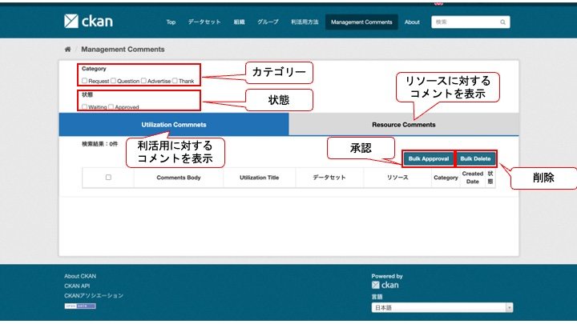

# 管理者用画面

データリソースや利活用方法へ投稿されたコメントを管理する画面

## 機能説明

### 基本機能

* 投稿されたコメントに対して以下の動作を行うことができます。
  * **承認**：コメントをパブリックに公開する
  * **削除**：不適切と判断したコメントを削除する
    * 承認を行わなかった場合、コメントを一般ユーザが閲覧することは出来ません

### 画面

* カテゴリー
  * チェックボックスにて選択したカテゴリーのコメントのみを表示する
  * カテゴリーについては次の4つが存在する
    * 要望/質問/宣伝/感謝

* 状態
  * チェックボックスにて選択した状態のコメントのみを表示する
  * 状態については次の2つが存在する
    * 承認待ち/承認済み

* 一括承認
  * 左端のチェックボックスにチェックが入っているコメントを一括承認できる

* 一括削除
  * 左端のチェックボックスにチェックが入っているコメントを一括削除できる
