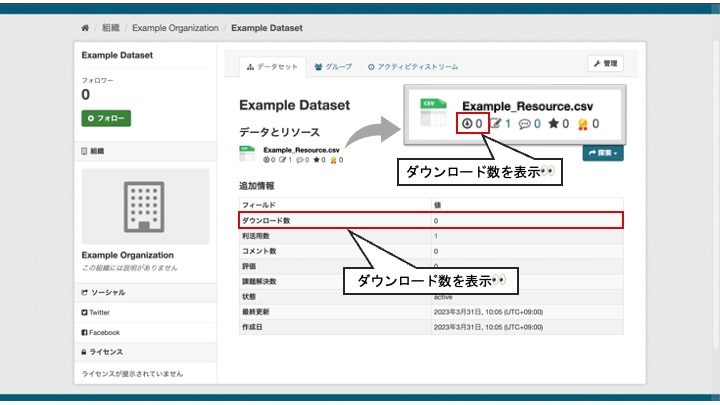

# download モジュール

ダウンロード数を集計し、可視化するモジュールです。

## 機能説明

* データリソースごとのダウンロード数を集計することが出来ます

* 以下の2つの集計情報を可視化することが出来ます
  * データリソースごとのダウンロード数
  * パッケージ内のリソースごとのダウンロード数の合計

【download モジュール　イメージ図】  

## 導入の利点

* データの利活用状況を知ることができる
  * データの公開や整備の計画を立てる際の指針になる
  * オープンデータの重要性をより認識することができる
