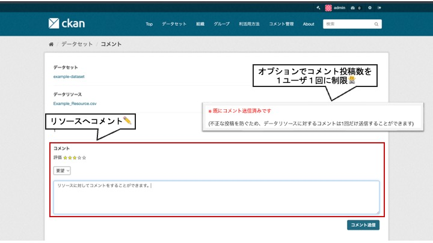

# resource モジュール

データリソースに対してコメントや評価ができるモジュールです。

## 導入の利点

* データの利活用状況を知ることができる
  * データの公開や整備の計画を立てる際の指針になる
  * オープンデータの重要性をより認識することができる

* データへの問い合わせが簡単にできる
  * データへの理解が進み、利活用が進む

## 機能説明

【resource モジュール　コメント登録画面　イメージ図】  

【resource モジュール　データセット詳細画面　イメージ図】  
  

* データリソースに対して以下のことが出来ます
  * データリソースごとへのコメント
  * データリソースごとへの評価

* 以下の2つ集計情報を可視化することが出来ます
  * データリソースへの評価を星5つで表示
  * データリソースへのコメント数
