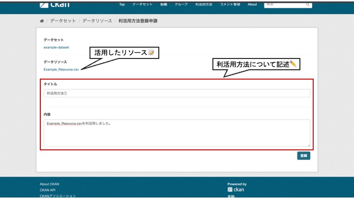
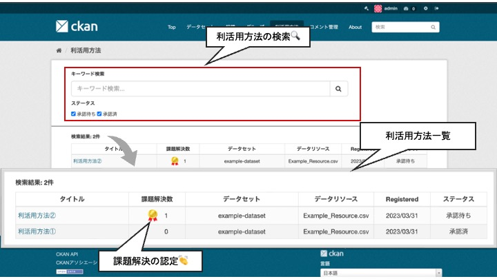

# utilization モジュール

データに紐づけて利活用方法を登録することができるモジュールです。  
登録した利活用方法へコメントを送ることも出来ます。

## 導入の利点

* データの利活用状況を知ることができる
  * データの公開や整備の計画を立てる際の指針になる
  * オープンデータの重要性をより認識することができる

* データを使った利活用方法の利用と改善が進む

## 機能説明

【登録画面　イメージ図】  

  

【利活用方法検索画面　イメージ図】  

  

【利活用方法詳細画面　イメージ図】  

  

【リソース詳細画面　イメージ図】  

* データを利活用したアプリやシステムに対して以下のことが出来ます
  * 利活用方法の紹介
  * 課題解決の認定
  * 利活用方法へのコメント

* 以下の3つの集計情報を可視化することが出来ます
  * データリソースごとの利活用数
  * 利活用の課題解決数
  * 利活用方法へのコメント数
